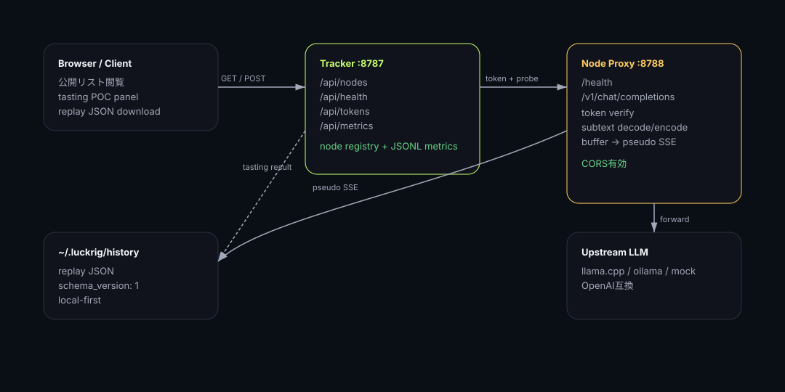
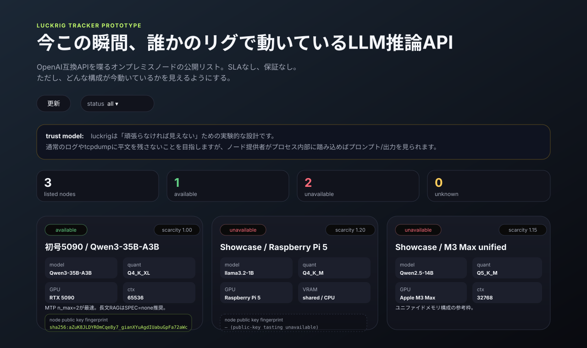
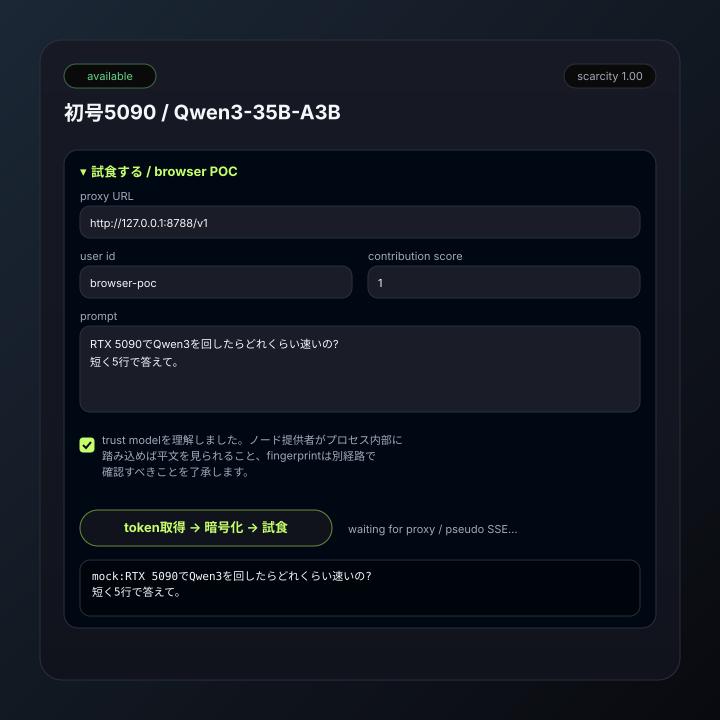
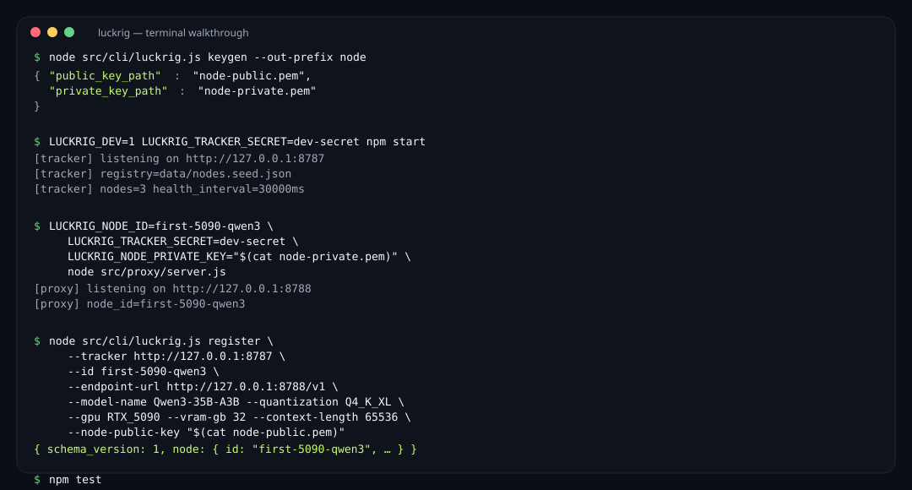

# luckrig 操作マニュアル

対象バージョン: 現在のPOC実装  
関連文書: [`CONCEPT.md`](./CONCEPT.md), [`SPEC.md`](./SPEC.md), [`USERSTORY.md`](./USERSTORY.md), [`docs/poc.md`](./docs/poc.md)

---

## 1. このマニュアルについて

この文書は、luckrig POCをローカルで動かし、以下を一通り確認するための日本語マニュアルです。

- 公開ノードリストを表示する
- trackerを起動する
- node proxyを起動する
- ノードを登録する
- tokenを発行する
- ブラウザから試食する
- CLI / Node E2Eでpublic-key modeを試す
- replay JSONを保存する
- テストを実行する

luckrigは一般ユーザー向けサービスではなく、**ローカルLLMを自力で構築・評価できるエンジニア向けの実験的POC**です。

---

## 2. 重要な注意事項

### 2.1 SLAなし・保証なし

luckrigは「今動いているかもしれない誰かのリグ」を試す場所です。

保証しません:

- 可用性
- 応答速度
- 出力品質
- セキュリティ
- 業務利用適性

ノードが落ちてもペナルティはありません。trackerは自動で `unavailable` として扱います。

### 2.2 trust model

luckrigのプライバシー設計は「頑張らなければ見えない」です。

目指すこと:

- 通常のログに平文prompt/responseを残さない
- tcpdump等で見ても平文が見えない
- subtext + 暗号化payloadで通信する

できないこと:

- 悪意あるノード提供者から完全に隠す
- ノード提供者がproxy/推論プロセス内部をinstrumentすることを防ぐ
- tracker + nodeが共謀して公開鍵をすり替えることを完全に防ぐ

試食前には、node public key fingerprintを別経路で確認してください。

### 2.3 POC上の暗号モード

現在のPOCには2つの経路があります。ブラウザ試食もnode public keyがある場合はpublic-key modeを使います。

| 経路 | 用途 | 状態 |
| --- | --- | --- |
| public-key mode | Node/CLI E2Eおよびブラウザ試食。node public key / user public keyを使う | 実装済み |
| legacy session-secret mode | node public keyがない古いノード向けfallback | 実装済み・後方互換扱い |

public-key modeを前提にし、UIではfingerprint一致入力を必須にしています。さらに強い運用をする場合は、GitHub等の別経路でfingerprintを公開してください。

---

## 3. 必要条件

- Node.js `>=22`
- npm
- OpenAI互換APIを喋るローカルLLMサーバー（任意）
  - 例: llama.cpp server, ollama等
- POCだけならローカルLLMサーバーは不要
  - `LUCKRIG_UPSTREAM_URL` を未設定にするとmock応答になります

依存npm packageはありません。Node.js標準ライブラリのみで動きます。

---

## 4. 初回セットアップ

```bash
cd /home/gen/Documents/luckrig
npm test
```

Codexサンドボックス内でgitを使う場合は、最初に以下を実行します。

```bash
source .tools/git-env.sh
```

通常のローカル環境では不要です。

---

## 5. 全体構成



```text
Browser UI / client
  ↓ GET /api/nodes, POST /api/tokens
Tracker :8787
  ↓ health probe
Node Proxy :8788
  ↓ OpenAI-compatible request
llama.cpp / ollama / mock upstream
```

主要ファイル:

```text
src/tracker/server.js      tracker
src/proxy/server.js        node proxy
src/cli/luckrig.js         CLI
src/subtext/index.js       subtext暗号化/復号
src/shared/keyhandshake.js public-key envelope
src/client/replay.js       replay生成/保存
public/                    公開リスト + ブラウザ試食POC
```

---

## 6. テスト実行

### 6.1 すべて実行

```bash
npm test
```

実行内容:

```bash
npm run check
npm run test:smoke
npm run test:e2e
```

### 6.2 Syntax check

```bash
npm run check
```

対象:

- tracker
- proxy
- CLI
- subtext
- keyhandshake
- client/replay
- client/tasting
- public/app.js

### 6.3 Smoke test

```bash
npm run test:smoke
```

確認内容:

- seed node registryを読み込める
- health probeが走る
- metrics summaryが生成される
- public UI markerが存在する
- fingerprint UI markerが存在する
- browser tasting/trust UI markerが存在する

### 6.4 E2E test

```bash
npm run test:e2e
```

確認内容:

- token発行
- public-key mode
- subtext encrypt/decrypt
- proxy処理
- pseudo SSE
- replay保存/読み戻し
- limited tier truncation
- invalid token拒否

Codexサンドボックスではlocal port listenが `EPERM` になることがあるため、E2E testはHTTP serverをlistenせずhandlerを直接呼びます。

---

## 7. trackerを起動する

別terminalで以下を実行します。

```bash
cd /home/gen/Documents/luckrig
LUCKRIG_DEV=1 \
LUCKRIG_TRACKER_SECRET=dev-secret \
npm start
```

既定値:

```text
http://127.0.0.1:8787
```

確認:

```bash
curl http://127.0.0.1:8787/api/health
curl http://127.0.0.1:8787/api/nodes
```

ブラウザで開く:

```text
http://127.0.0.1:8787/
```

### 7.1 trackerの主要環境変数

| 変数 | 既定値 | 説明 |
| --- | --- | --- |
| `LUCKRIG_HOST` | `127.0.0.1` | bind host |
| `LUCKRIG_PORT` | `8787` | bind port |
| `LUCKRIG_DEV` | unset | `1`でdev登録APIを有効化 |
| `LUCKRIG_TRACKER_SECRET` | dev default | token署名secret |
| `LUCKRIG_REGISTRY_PATH` | `data/nodes.seed.json` | node registry |
| `LUCKRIG_METRICS_PATH` | `data/metrics.jsonl` | runtime metrics JSONL mirror |
| `LUCKRIG_TOKEN_USAGE_PATH` | `data/token-usage.jsonl` | token usage JSONL mirror |
| `LUCKRIG_DB_PATH` | `data/luckrig.sqlite` | SQLite永続DB |
| `LUCKRIG_USE_SQLITE` | enabled | `0`でSQLiteを無効化 |
| `LUCKRIG_HEALTH_INTERVAL_MS` | `30000` | health probe間隔 |
| `LUCKRIG_HEALTH_TIMEOUT_MS` | `2000` | health probe timeout |

---

## 8. 鍵を生成する

public-key modeを試す場合、node用とuser用の鍵を生成します。

```bash
node src/cli/luckrig.js keygen --out-prefix node
node src/cli/luckrig.js keygen --out-prefix user
```

生成物:

```text
node-public.pem
node-private.pem
user-public.pem
user-private.pem
```

注意:

- `*-private.pem` は公開しないでください
- `node-public.pem` はtracker登録に使います
- `user-public.pem` はtoken発行時に使います

---

## 9. node proxyを起動する

### 9.1 mock upstreamで起動

ローカルLLMサーバーなしで試す場合:

```bash
cd /home/gen/Documents/luckrig
LUCKRIG_NODE_ID=first-5090-qwen3 \
LUCKRIG_TRACKER_SECRET=dev-secret \
LUCKRIG_NODE_PRIVATE_KEY="$(cat node-private.pem)" \
node src/proxy/server.js
```

既定値:

```text
http://127.0.0.1:8788
```

mock modeでは、prompt `hello` に対して `mock:hello` のような応答を返します。

### 9.2 llama.cpp / ollama等にforwardする

OpenAI互換APIが `http://127.0.0.1:8088/v1` で動いている例:

```bash
LUCKRIG_NODE_ID=first-5090-qwen3 \
LUCKRIG_TRACKER_SECRET=dev-secret \
LUCKRIG_NODE_PRIVATE_KEY="$(cat node-private.pem)" \
LUCKRIG_UPSTREAM_URL=http://127.0.0.1:8088/v1 \
node src/proxy/server.js
```

proxyは以下を提供します:

```text
GET  /health
POST /v1/chat/completions
POST /chat/completions
```

### 9.3 proxyの主要環境変数

| 変数 | 既定値 | 説明 |
| --- | --- | --- |
| `LUCKRIG_PROXY_HOST` | `127.0.0.1` | bind host |
| `LUCKRIG_PROXY_PORT` | `8788` | bind port |
| `LUCKRIG_NODE_ID` | `local-poc-node` | tokenと照合するnode id |
| `LUCKRIG_TRACKER_SECRET` | dev default | trackerと共有するPOC secret |
| `LUCKRIG_NODE_PRIVATE_KEY` | unset | public-key prompt復号用秘密鍵 |
| `LUCKRIG_UPSTREAM_URL` | unset | OpenAI互換upstream。未設定ならmock |
| `LUCKRIG_LIMITED_OUTPUT_CHARS` | `240` | limited tier出力truncate長 |

---

## 10. ノードを登録する

tracker起動中に、別terminalから実行します。

```bash
node src/cli/luckrig.js register \
  --tracker http://127.0.0.1:8787 \
  --id first-5090-qwen3 \
  --endpoint-url http://127.0.0.1:8788/v1 \
  --health-url http://127.0.0.1:8788/health \
  --model-name Qwen3-35B-A3B \
  --quantization Q4_K_XL \
  --gpu RTX_5090 \
  --vram-gb 32 \
  --context-length 65536 \
  --node-public-key "$(cat node-public.pem)"
```

`LUCKRIG_DEV=1` でtrackerを起動していない場合、登録APIは拒否されます。

### 10.1 dry-run

実際にPOSTせずrequest内容だけ確認できます。

```bash
node src/cli/luckrig.js register \
  --dry-run \
  --endpoint-url http://127.0.0.1:8788/v1 \
  --model-name test-model \
  --quantization Q4_K_M \
  --gpu RTX_4090
```

---

## 11. tokenを発行する

### 11.1 public-key mode

```bash
node src/cli/luckrig.js token \
  --tracker http://127.0.0.1:8787 \
  --node-id first-5090-qwen3 \
  --user-id alice \
  --contribution-score 1 \
  --user-public-key "$(cat user-public.pem)"
```

返却内容には以下が含まれます。

```json
{
  "token_type": "Bearer",
  "token": "...",
  "crypto_mode": "public-key",
  "session_secret": null,
  "node_public_key": "...",
  "node_public_key_fingerprint": "sha256:...",
  "user_public_key_fingerprint": "sha256:..."
}
```

### 11.2 legacy session-secret mode

`user_public_key` を渡さない場合、後方互換のsession-secret modeになります。

```bash
node src/cli/luckrig.js token \
  --tracker http://127.0.0.1:8787 \
  --node-id first-5090-qwen3 \
  --user-id browser-poc \
  --contribution-score 0
```

node public keyがないノードではこのmodeにfallbackします。通常はpublic-key modeを使ってください。

---

## 12. ブラウザで試食する



### 12.1 起動するもの

1. tracker
2. node proxy

例:

```bash
# terminal 1
LUCKRIG_DEV=1 \
LUCKRIG_TRACKER_SECRET=dev-secret \
npm start
```

```bash
# terminal 2
LUCKRIG_NODE_ID=first-5090-qwen3 \
LUCKRIG_TRACKER_SECRET=dev-secret \
node src/proxy/server.js
```

node public keyを持つノードでブラウザ試食する場合はpublic-key modeになるため、proxy側に対応する `LUCKRIG_NODE_PRIVATE_KEY` が必要です。node public keyがないノードではlegacy session-secret fallbackになります。

### 12.2 UI操作

ブラウザで開きます。

公開リストはデフォルトでscarcity/Showcase順に並びます。

```text
http://127.0.0.1:8787/
```

ノードカード内の `試食する / browser POC` を開きます。

入力:

| 項目 | 説明 |
| --- | --- |
| proxy URL | 通常は `http://127.0.0.1:8788/v1` |
| user id | 任意。例: `browser-poc` |
| contribution score | `0`ならlimited、`1`以上ならcontributor |
| prompt | 試したいprompt |
| trust checkbox | 必須 |

実行:

```text
token取得 → 暗号化 → 試食
```

成功すると:

- responseが画面に表示される
- replay JSON download linkが出る



### 12.3 limited tierの挙動

`contribution score = 0` の場合、token tierは `limited` です。

proxyは既定で応答を240文字にtruncateします。

```bash
LUCKRIG_LIMITED_OUTPUT_CHARS=240
```

replay JSONには以下が入ります。

```json
{
  "limited_output_truncated": true
}
```

---

## 13. replay JSON

ブラウザ試食またはclient helperで生成されるreplayは、以下のような形式です。

```json
{
  "schema_version": 1,
  "created_at": "2026-05-22T07:00:00.000Z",
  "prompt": "hello",
  "response": "mock:hello",
  "node_id": "first-5090-qwen3",
  "queue_wait_sec": 0,
  "generation_sec": 0.012,
  "tok_per_sec": 250,
  "ttft_ms": 100,
  "chunk_timestamps": [1779430000000],
  "limited_output_truncated": false
}
```

注意:

- POCのtoken推定は簡易的です
- 現在のtok/sは簡易推定です。より正確にする場合はmodel tokenizer連携を追加してください
- replayはlocal-firstであり、trackerへ自動送信しません

---

## 14. 公開リストの見方

ノードカードには以下が表示されます。

| 表示 | 意味 |
| --- | --- |
| status | `available`, `unavailable`, `unknown` |
| scarcity | rarity/Showcase寄りの簡易score |
| model | モデル名 |
| quant | 量子化 |
| GPU / VRAM / ctx | 実行環境 |
| tuning note | ノード提供者のメモ |
| node public key fingerprint | 公開鍵fingerprint |
| samples / availability | health probe集計 |

デフォルト表示は高スペック順ではありません。CONCEPTに従い、希少性・Showcaseが見える順序です。

---

## 15. metrics JSONL

trackerはhealth probeの結果をSQLiteに保存し、互換用にJSONL mirrorにも追記します。

既定:

```text
data/metrics.jsonl
```

SQLite DBとJSONL mirrorはruntime dataなのでgit管理外です。

確認API:

```bash
curl http://127.0.0.1:8787/api/metrics
curl http://127.0.0.1:8787/api/metrics/first-5090-qwen3
```

詳細は [`docs/metrics-schema.md`](./docs/metrics-schema.md) を参照してください。

---

## 16. よくあるトラブル

### 16.1 `listen EPERM` が出る

Codexサンドボックスではlocal port listenが制限されることがあります。

対処:

- 通常のローカルshellで起動する
- サンドボックス内では `npm test` を使う

E2E testはlisten不要にしてあります。

### 16.2 `POST /api/nodes` が403になる

trackerを `LUCKRIG_DEV=1` で起動してください。

```bash
LUCKRIG_DEV=1 npm start
```

### 16.3 proxyがtokenを拒否する

確認してください:

- trackerとproxyの `LUCKRIG_TRACKER_SECRET` が同じか
- tokenの `node_id` とproxyの `LUCKRIG_NODE_ID` が同じか
- tokenが期限切れでないか

### 16.4 public-key modeで復号に失敗する

確認してください:

- token発行時の `node_public_key` とproxyの `LUCKRIG_NODE_PRIVATE_KEY` がペアか
- token発行時の `user_public_key` とclient側 `user-private.pem` がペアか
- PEMの改行が壊れていないか

### 16.5 ブラウザ試食でCORS errorになる

現在のproxyはCORS対応済みです。古いproxyプロセスを再起動してください。

```bash
node src/proxy/server.js
```

### 16.6 replay downloadが出ない

以下を確認してください:

- trust checkboxを入れたか
- promptを入力したか
- proxy URLが正しいか
- proxyが起動しているか
- token取得に成功しているか

---

## 17. 開発時のgit運用（Codexサンドボックス）

この環境では `.git/` がread-only tmpfsでマスクされることがあります。プロジェクトではgitdirを別領域に分離しています。

セッション開始時:

```bash
source .tools/git-env.sh
```

詳細:

- `AGENTS.md` §9
- `~/.codex/memories/sandbox-git.md`
- `~/.codex/memories/luckrig.md`

---

## 18. 現時点でv1範囲外または今後強化する課題

v1/POCとして一通り動きます。今後の強化項目は以下です。

- filter ruleの運用チューニング
- SQLite schema migration管理
- durable quotaの管理UI
- 実model tokenizer連携によるtok/s精度向上
- Tailscale等を含む本番運用向けnode provider docsの拡充
- contribution scoreの本採点
- v6以降の画像/音声系対応

---

## 19. 最短確認手順




mock upstreamで最短確認する場合:

```bash
# terminal 1
cd /home/gen/Documents/luckrig
LUCKRIG_DEV=1 LUCKRIG_TRACKER_SECRET=dev-secret npm start
```

```bash
# terminal 2
cd /home/gen/Documents/luckrig
LUCKRIG_NODE_ID=first-5090-qwen3 LUCKRIG_TRACKER_SECRET=dev-secret node src/proxy/server.js
```

ブラウザ:

```text
http://127.0.0.1:8787/
```

操作:

1. `試食する / browser POC` を開く
2. proxy URLが `http://127.0.0.1:8788/v1` になっていることを確認
3. promptを入力
4. trust checkboxを入れる
5. `token取得 → 暗号化 → 試食` を押す
6. responseとreplay downloadを確認

CLI/Node E2Eで確認する場合:

```bash
npm test
```


---

## 20. スクリーンショットについて

この文書に埋め込まれている図は、現サンドボックスでブラウザを起動できないため、`public/styles.css` の実カラーから生成した **SVGモックアップ** です（写真ではありません）。

実際のスクリーンショットを撮りたい場合は、通常のローカルshellで以下のように行ってください。

### macOSの例

```bash
LUCKRIG_DEV=1 LUCKRIG_TRACKER_SECRET=dev-secret npm start &
node src/proxy/server.js &
open http://127.0.0.1:8787/
# Cmd+Shift+4 で範囲選択スクリーンショット
```

### Linux + Chrome headless 例

```bash
LUCKRIG_DEV=1 LUCKRIG_TRACKER_SECRET=dev-secret npm start &
node src/proxy/server.js &
google-chrome \
  --headless=new \
  --no-sandbox \
  --hide-scrollbars \
  --window-size=1280,1600 \
  --screenshot=docs/images/overview.png \
  http://127.0.0.1:8787/
```

撮影後は `docs/images/*.svg` を `docs/images/*.png` に置き換え、本マニュアル内のリンク先も差し替えてください。SVGモックアップと現UIに乖離がないかも併せて確認してください。

