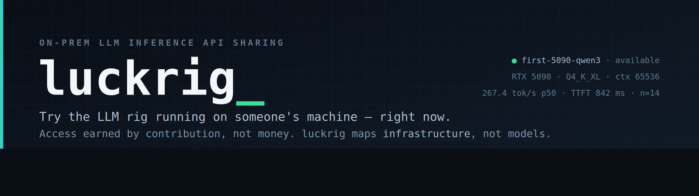
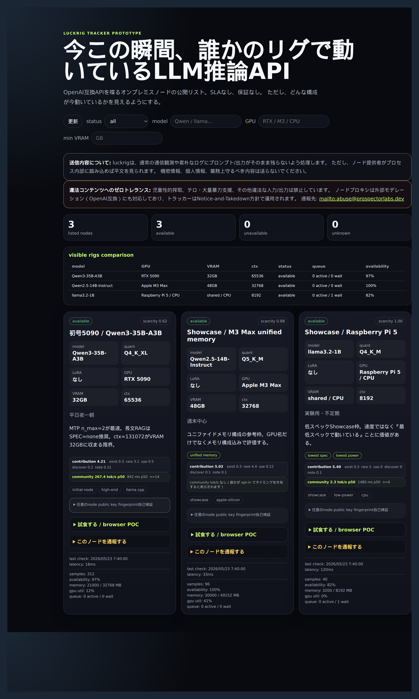

# luckrig

[日本語](./README.md) | **English**



> A place to try, right now, the LLM inference API running on someone else's on-prem rig — access earned through contribution.

> [!NOTE]
> This is a **concept + working POC**, not an operating hosted service. There is no public tracker or node, and this is not a live platform you can join right now. The repository exists to share the design philosophy, a prototype implementation, and the record of design decisions. For the legal premises of actually operating it, see [`LEGALISSUE.md`](./LEGALISSUE.md) (which is **not** legal advice).

An on-premises LLM inference API sharing platform. It ports Hotline Connect's "contribution-based access rights" to the local-LLM world, letting a community share OpenAI-compatible APIs as mutual aid.

- **luck** (drawing a lucky pick) + **rig** (your own environment / gear)
- No SLA is guaranteed. If you're lucky, you land on a fast node
- If LMSys Arena is a map of *model* evaluation, luckrig is a **real-time map of *infrastructure* evaluation**

See [`CONCEPT.md`](./CONCEPT.md) for the full concept. It is the source of truth for this project, and every design decision is checked against it.

See [`SPEC.md`](./SPEC.md) for the technical specification — POC scope, API, data model, and test requirements.

See [`USERSTORY.md`](./USERSTORY.md) for user stories and acceptance criteria.

See [`MANUAL.md`](./MANUAL.md) for operating instructions.

See [`BACKLOG.md`](./BACKLOG.md) for what remains beyond POC v1 (field validation / v6 features / operational hardening).

See [`LEGALISSUE.md`](./LEGALISSUE.md) for legal and compliance topics (the areas code cannot solve). This is not legal advice — it is a checklist of items to review with a lawyer before going live.

## Components

| Component | Role |
| --- | --- |
| **Tracker** | Accepts node registration, monitors liveness, issues short-lived tokens based on contribution score |
| **Node Proxy** | Sits in front of ollama/llama.cpp. Real SSE (OpenAI-compatible) is the baseline; in subtext mode it handles decrypt/encrypt, queue buffering, and pseudo SSE |
| **CLI** | One-line node registration and automatic proxy-layer setup |
| **Web (tasting UI)** | Browse the public list, obtain a token, queue UX, replay playback |
| **subtext (optional)** | A scheme that embeds an encrypted payload invisibly via Unicode variation selectors. Defense-in-depth so only cover text remains in the node's proxy logs. Off by default |

## Scope (v1)

- Limited to text generation (OpenAI-compatible API)
- plain mode (baseline): real SSE that vanilla OpenAI clients work against unchanged
- subtext mode (optional): defense-in-depth so no plaintext is left in the node's proxy logs
- Image generation / audio / recognition wait until the overall tasting-UX consistency design is established (v6+)

## Differentiation from close prior art

- **AI Horde** (kudos-based contribution mutual aid): abstracts away the worker, hiding the hardware. luckrig does the opposite — it makes **the hardware the star** (environment metadata, tuning notes, naming a specific rig, rarity-based ordering).
- **Petals**: distributed inference of large models across nodes. luckrig is one-node-one-inference; distributed inference is out of scope.

## About what you send

plain mode (baseline) relies on TLS plus the node proxy's "do not write plaintext to logs" convention. subtext mode (optional) adds, on top of that, defense-in-depth that leaves only cover text in the node's proxy logs. Either way, a node operator who instruments the process internals can see plaintext. Do not send confidential information, personal data, or anything you are obligated to protect.

## Zero tolerance for illegal content, and the reporting path

Child sexual exploitation, support for terrorism / mass violence, and any other illegal input/output are prohibited. luckrig responds in three stages:

1. A local regex filter in the node proxy
2. An external moderation hook in the node proxy (`LUCKRIG_MODERATION_ENDPOINT`, OpenAI-Moderation-compatible; **input is blocked before forwarding and fails closed when the endpoint is unreachable**; output defaults to `record` — streaming is preserved and the outcome is logged after the fact — so plain mode's real SSE is not broken. Switch to `block` if you have legal requirements)
3. Notice-and-Takedown on the tracker side: `POST /api/abuse/report` (anyone can report; IP rate-limited; **no automatic ban**) / `POST /api/bans` (operator bans manually after review; `LUCKRIG_DEV=1`)

The abuse contact is exposed via `GET /api/abuse-contact`. See SPEC.md §7.1b / §7.1c for details.

## Minimum implementation order

From CONCEPT.md §"Minimum implementation order":

1. Public node list (for anonymous visitors, liveness monitoring included)
2. Automatic benchmark collection (memory usage, error rate)
3. Node registration CLI + luckrig proxy layer
4. Token issuance logic
5. Tasting UI (obtain token → queue UX → pseudo SSE)
6. Replay feature (local persistence, `~/.luckrig/history/`)
7. Contribution score and access management

## Current prototype

A dependency-free **POC prototype** is implemented. tracker / token / proxy / subtext / pseudo SSE / replay can be verified end-to-end.



> The shot above is the public list UI loaded with the three seed nodes (RTX 5090 / Apple M3 Max / Raspberry Pi 5). The default order is by rarity score — a Showcase, not a leaderboard.

```bash
source .tools/git-env.sh   # when using git inside the Codex sandbox
npm start                  # http://127.0.0.1:8787
npm run check
npm run test:smoke
npm run test:e2e
npm test
```

- Public list UI: `GET /`
- tracker health: `GET /api/health`
- node list: `GET /api/nodes`
- details: [`docs/tracker-api.md`](./docs/tracker-api.md)
- metrics schema: [`docs/metrics-schema.md`](./docs/metrics-schema.md)
- POC E2E: [`docs/poc.md`](./docs/poc.md)

As the current v1/POC, the public list, fingerprint display / optional verification, the browser public-key tasting POC, the privacy caveat checkbox, liveness monitoring, SQLite/JSONL persistence, durable token quota, prompt filter, token, node proxy, subtext, pseudo SSE, and replay saving are all wired together.

## Status

v1/POC complete. The public list, liveness monitoring, SQLite/JSONL persistence, token, durable limited quota, prompt filter, node proxy, public-key subtext, browser public-key tasting, queue visualization, environment filter / comparison view, multi-axis contribution score, auto-generated Showcase, persistent browser identity, optional out-of-band fingerprint verification, IP token rate limiting, heuristic-tokenizer replay, pseudo SSE, and replay saving are all implemented using only the Node.js standard library. Concept v5.6 finalized.

## License

[Apache License 2.0](./LICENSE). Its explicit warranty disclaimer (§7 Disclaimer of Warranty) is consistent with luckrig's "we don't guarantee anything, but you can try it" stance on liability.
